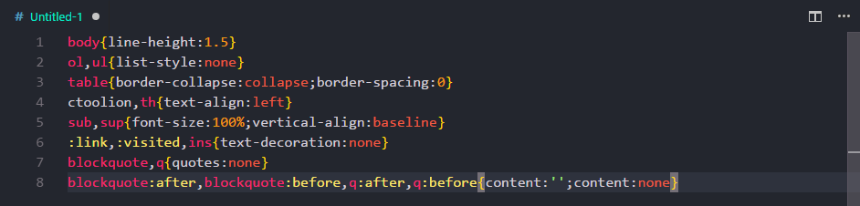
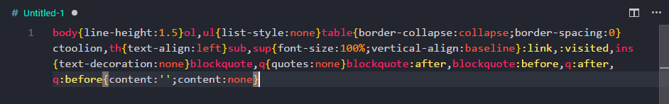

# CSS Compressor

 Clean and [Compact | Minify] your CSS files , comb the order of css attribute .

 Actually you also can Beautify your css file with option`{format: 'beautify'}`

## Thanks

This extension completely depend on [clean-css](https://www.npmjs.com/package/clean-css) and the author is [jakubpawlowicz](https://github.com/jakubpawlowicz/clean-css) , thanks  nice man!

Screenshot tools [snipaste](https://www.snipaste.com/)

icon [icons8](https://icons8.com/)

## Usage

Press shortcuts `shift`+`alt`+`f` to format CSS file (make sure current file you edit type is css)

## Screenshot:

## Options
reference for [here](https://github.com/jakubpawlowicz/clean-css#formatting-options)

- default option
  ```
  {
    format: 'keep-breaks',
    compatibility: 'ie8'
  }
  ```

  (oh , ie8 I know !)

  result

  

- beautify output

  ```
  {
    format: 'beautify'
  }
  ```

  result

  

  yes , you can disableb break between two selectors see [options](https://github.com/jakubpawlowicz/clean-css#formatting-options)

- with empty option will output minify css file

  ```
  { }
  ```
  